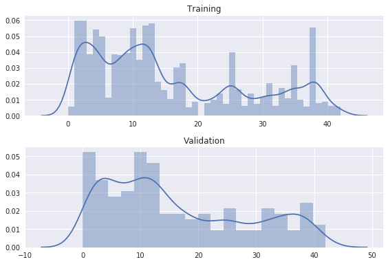
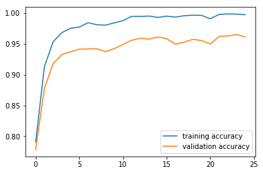

#**Traffic Sign Recognition** 

The goals / steps of this project are the following:
* Load the data set (see below for links to the project data set)
* Explore, summarize and visualize the data set
* Design, train and test a model architecture
* Use the model to make predictions on new images
* Analyze the softmax probabilities of the new images
* Summarize the results with a written report


## Rubric Points

###Here I will consider the [rubric points](https://review.udacity.com/#!/rubrics/481/view) individually and describe how I addressed each point in my implementation.  


#### 1. Provide a Writeup / README that includes all the rubric points and how you addressed each one. You can submit your writeup as markdown or pdf. You can use this template as a guide for writing the report. The submission includes the project code.

You're reading it! 

###Data Set Summary & Exploration
[Notebook](Part_1_Data_processing_and_augmentation.ipynb)

I used the pandas library to calculate summary statistics of the traffic signs data set:

* The size of training set is 34799
* The size of the validation set is 4410
* The size of test set is 12630
* The shape of a traffic sign image is (32, 32, 3)
* The number of unique classes/labels in the data set is 43

#### 2. Include an exploratory visualization of the dataset.

Here is an exploratory visualization of the data set. Here we look at the distribution of classes among the training and validation set. It looks like the classes are generally distributed the same way between the two sets. I didn't have to rebalance classes for this project, but that's something to look out for.



Below is a sample of images and their classes from the training dataset.


### Design and Test a Model Architecture

####1. Describe how you preprocessed the image data. What techniques were chosen and why did you choose these techniques? Consider including images showing the output of each preprocessing technique. Pre-processing refers to techniques such as converting to grayscale, normalization, etc. 

I augmented the training dataset by 
* rotating
* adding a random streak of horizontal / vertical line

Note: I got this relatively simple idea from stackoverflow (but cannot find the link now to acknowkledge the source :( ))

```
from scipy.ndimage.interpolation import rotate
def add_jitter(img):
    if np.random.random() > 0.1:
        img = rotate(img, angle = np.random.randint(-10,10,1), reshape=False)
    if np.random.random() > 0.5:
        img[np.random.randint(0,32,1), :] = 0
    if np.random.random() > 0.5:
        img[:, np.random.randint(0,32,1)] = 0
    return img
```

Example of the changes from the `add_jitter` function: 


#### 2. Describe what your final model architecture looks like including model type, layers, layer sizes, connectivity, etc.) Consider including a diagram and/or table describing the final model.

My final model consisted of the following layers:

| Layer         		|     Description	        					| 
|:---------------------:|:---------------------------------------------:| 
| Input         		| 32x32x3 RGB image   							| 
| Convolution 3x3     	| 1x1 stride, same padding, outputs 32x32x5 	|
| Max pooling	      	| 1x1 stride, same padding, outputs 32x32x5		|
| Convolution 3x3	    | 1x1 stride, same padding, outputs 32x32x10	|
| Max pooling	      	| 1x1 stride, same padding, outputs 32x32x10	|
| Convolution 3x3	    | 1x1 stride, same padding, outputs 32x32x20	|
| Max pooling	      	| 1x1 stride, same padding, outputs 32x32x20	|
| Dropout 				| keep_prob = 0.5								|
| Convolution 5x5	    | 1x1 stride, valid padding, outputs 28x28x25	|
| Max pooling	      	| 2x2 stride, valid padding, outputs 14x14x25	|
| Convolution 5x5	    | 1x1 stride, valid padding, outputs 10x10x30	|
| Max pooling	      	| 2x2 stride, valid padding, outputs 5x5x30		|
| Flattening			| Flattens to output a layer with 750 neurons	|
| Fully connected (relu)| Contains 43 neurons        					|
| Fully connected, softmax | Output layer	       						|


#### 3. Describe how you trained your model. The discussion can include the type of optimizer, the batch size, number of epochs and any hyperparameters such as learning rate.

* I trained the model for 25 epochs using the Adam optimizer. 
* I started with a learning rate of 0.001
* At every 10th epoch, I halved the learning rate. 
* I used a batch size of 128

#### 4. Describe the approach taken for finding a solution and getting the validation set accuracy to be at least 0.93. Include in the discussion the results on the training, validation and test sets and where in the code these were calculated. Your approach may have been an iterative process, in which case, outline the steps you took to get to the final solution and why you chose those steps. Perhaps your solution involved an already well known implementation or architecture. In this case, discuss why you think the architecture is suitable for the current problem.



My final model results were:
* training set accuracy of 99.7 %
* validation set accuracy of 96.1 %
* test set accuracy of 95.0 %

I spent a lot of time playing around with the LeNet architecture. However, I kept overfitting the training set as my validation accuracy was always 10 % pts less than the training accuracy. No amount of adding drop out layers fixed that issue. So I started cutting down on the depth of the convolutional layers. I also drastically reduced the size of the final fully connected layers to bring down the number of parameters by several orders of magnitude. 
 

### Test a Model on New Images

#### 1. Choose five German traffic signs found on the web and provide them in the report. For each image, discuss what quality or qualities might be difficult to classify.

Here are five German traffic signs that I found on the web:


The first image might be difficult to classify because ...

####2. Discuss the model's predictions on these new traffic signs and compare the results to predicting on the test set. At a minimum, discuss what the predictions were, the accuracy on these new predictions, and compare the accuracy to the accuracy on the test set (OPTIONAL: Discuss the results in more detail as described in the "Stand Out Suggestions" part of the rubric).

Here are the results of the prediction:

| Image			        |     Prediction	        					| 
|:---------------------:|:---------------------------------------------:| 
| Stop Sign      		| Stop sign   									| 
| U-turn     			| U-turn 										|
| Yield					| Yield											|
| 100 km/h	      		| Bumpy Road					 				|
| Slippery Road			| Slippery Road      							|


The model was able to correctly guess 4 of the 5 traffic signs, which gives an accuracy of 80%. This compares favorably to the accuracy on the test set of ...

####3. Describe how certain the model is when predicting on each of the five new images by looking at the softmax probabilities for each prediction. Provide the top 5 softmax probabilities for each image along with the sign type of each probability. (OPTIONAL: as described in the "Stand Out Suggestions" part of the rubric, visualizations can also be provided such as bar charts)

The code for making predictions on my final model is located in the 11th cell of the Ipython notebook.

For the first image, the model is relatively sure that this is a stop sign (probability of 0.6), and the image does contain a stop sign. The top five soft max probabilities were

| Probability         	|     Prediction	        					| 
|:---------------------:|:---------------------------------------------:| 
| .60         			| Stop sign   									| 
| .20     				| U-turn 										|
| .05					| Yield											|
| .04	      			| Bumpy Road					 				|
| .01				    | Slippery Road      							|


For the second image ... 

### (Optional) Visualizing the Neural Network (See Step 4 of the Ipython notebook for more details)
####1. Discuss the visual output of your trained network's feature maps. What characteristics did the neural network use to make classifications?


